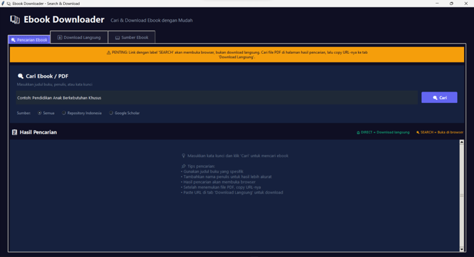
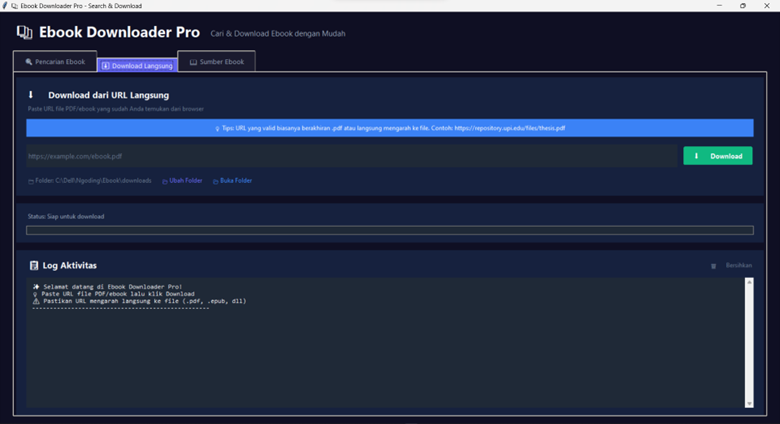
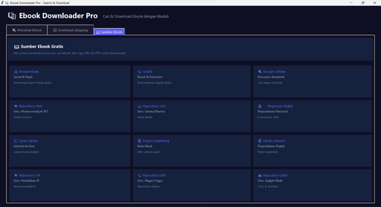

# 📚 Ebook Downloader Pro

<div align="center">


**Aplikasi desktop modern untuk mencari dan mengunduh ebook/PDF dari berbagai sumber akademik Indonesia dan internasional.**

[Fitur](#-fitur) • [Instalasi](#-instalasi) • [Penggunaan](#-penggunaan) • [Sumber Ebook](#-sumber-ebook-gratis) • [Kontribusi](#-kontribusi)

</div>

---

## ✨ Fitur

### 🔍 Pencarian Ebook
- Pencarian terpadu ke berbagai repository Indonesia
- Integrasi dengan Google Scholar
- Pencarian spesifik untuk file PDF
- Label visual untuk membedakan link langsung vs link pencarian

### ⬇️ Download Manager
- Download file dari URL langsung
- Progress bar real-time
- Validasi file PDF otomatis
- Deteksi otomatis jika file bukan PDF valid
- Log aktivitas detail

### 📖 Akses Repository
- 12+ repository ebook gratis
- Repository universitas Indonesia (UPI, UMJ, USD, UNY, UGM, dll)
- Repository internasional (ResearchGate, Google Scholar, Open Library, dll)
- Akses langsung dengan satu klik

### 🎨 Desain Modern
- Dark theme yang elegan
- Animated buttons dengan hover effects
- Interface yang responsif dan intuitif
- Tab-based navigation

---

## 📸 Screenshots

<div align="center">

### Tab Pencarian


### Tab Download


### Tab Sumber Ebook


</div>

---

## 🛠️ Instalasi

### Prasyarat
- Python 3.8 atau lebih baru
- pip (Python package manager)

### Langkah Instalasi

1. **Clone repository**
   ```bash
   git clone https://github.com/username/ebook-downloader-pro.git
   cd ebook-downloader-pro
   ```

2. **Install dependencies**
   ```bash
   pip install -r requirements.txt
   ```
   
   Atau install manual:
   ```bash
   pip install requests beautifulsoup4
   ```

3. **Jalankan aplikasi**
   ```bash
   python ebook_downloader_gui.py
   ```

---

## 📖 Penggunaan

### Metode 1: Mencari dan Download Ebook

#### Langkah 1: Cari Ebook
1. Buka tab **"🔍 Pencarian Ebook"**
2. Masukkan kata kunci (judul buku, penulis, atau topik)
3. Pilih sumber pencarian:
   - **Semua** - Mencari di semua sumber
   - **Repository Indonesia** - Fokus ke universitas Indonesia
   - **Google Scholar** - Paper dan jurnal akademik
4. Klik tombol **"🔍 Cari"**

#### Langkah 2: Temukan Link PDF
1. Hasil pencarian akan muncul dengan label:
   - 🔍 **SEARCH** = Link ke halaman pencarian (buka di browser)
   - 📥 **DIRECT** = Link download langsung
2. Klik **"🔍 Cari di Browser"** untuk membuka halaman pencarian
3. Di halaman browser, temukan file PDF yang diinginkan
4. **Klik kanan** pada tombol download → **"Copy link address"**

#### Langkah 3: Download
1. Buka tab **"⬇️ Download Langsung"**
2. **Paste** URL PDF yang sudah di-copy
3. Klik **"⬇️ Download"**
4. File akan tersimpan di folder `downloads/`

### Metode 2: Download Langsung dari URL

Jika Anda sudah memiliki URL file PDF:

1. Buka tab **"⬇️ Download Langsung"**
2. Paste URL file PDF
3. Klik **"⬇️ Download"**

### Metode 3: Akses Repository Langsung

1. Buka tab **"📖 Sumber Ebook"**
2. Klik pada repository yang diinginkan
3. Browser akan terbuka ke website repository tersebut
4. Cari ebook dan download manual

---

## 📚 Sumber Ebook Gratis

### Repository Indonesia 🇮🇩
| Repository | URL | Deskripsi |
|------------|-----|-----------|
| Repository UPI | repository.upi.edu | Universitas Pendidikan Indonesia |
| Repository UMJ | repository.umj.ac.id | Universitas Muhammadiyah Jakarta |
| Repository USD | repository.usd.ac.id | Universitas Sanata Dharma |
| Repository UNY | eprints.uny.ac.id | Universitas Negeri Yogyakarta |
| Repository UGM | etd.repository.ugm.ac.id | Universitas Gadjah Mada |
| Perpusnas Digital | e-resources.perpusnas.go.id | Perpustakaan Nasional RI |

### Repository Internasional 🌐
| Repository | URL | Deskripsi |
|------------|-----|-----------|
| ResearchGate | researchgate.net | Jurnal & Paper Akademik |
| Google Scholar | scholar.google.com | Pencarian Akademik |
| Scribd | scribd.com | Ebook & Dokumen |
| Open Library | openlibrary.org | Jutaan Buku Digital |
| Project Gutenberg | gutenberg.org | 60,000+ Ebook Gratis |
| Library Genesis | libgen.is | Perpustakaan Digital |

---

## 💡 Tips Pencarian

### Menemukan Link PDF yang Valid
URL PDF langsung biasanya terlihat seperti ini:
```
✅ https://repository.upi.edu/files/thesis.pdf
✅ https://eprints.uny.ac.id/12345/1/Skripsi.pdf
✅ https://www.researchgate.net/publication/12345.pdf
```

URL yang BUKAN link download langsung:
```
❌ https://www.google.com/search?q=...  (Halaman pencarian)
❌ https://repository.upi.edu/12345/    (Halaman preview)
❌ https://scribd.com/document/12345   (Perlu akun)
```

### Query Pencarian Efektif
Gunakan query spesifik untuk hasil terbaik:
```
"Pendidikan Anak Berkebutuhan Khusus" filetype:pdf site:ac.id
"metodologi penelitian" penulis:Sugiyono filetype:pdf
"machine learning" tutorial pdf free download
```

---

## 📁 Struktur Folder

```
ebook-downloader-pro/
│
├── ebook_downloader_gui.py    # Aplikasi GUI utama
├── ebook_downloader.py        # Versi CLI (command line)
├── requirements.txt           # Dependencies
├── README.md                  # Dokumentasi
│
├── downloads/                 # Folder tempat file tersimpan
│   └── *.pdf                  # File yang didownload
│
└── screenshots/               # Screenshots untuk dokumentasi
    ├── search_tab.png
    ├── download_tab.png
    └── repository_tab.png
```

---

## ⚠️ Catatan Penting

### Validasi File
Aplikasi ini secara otomatis memvalidasi file yang didownload:
- Jika file adalah PDF valid → disimpan dengan ekstensi `.pdf`
- Jika file adalah HTML (bukan PDF) → di-rename ke `.html` dengan peringatan

### Limitasi
- Beberapa website memerlukan login untuk download
- Beberapa file memerlukan akses khusus (berbayar/membership)
- Link Google Search tidak bisa didownload langsung
- Kecepatan download tergantung koneksi internet

### Legal & Etika
- Gunakan aplikasi ini hanya untuk mengunduh materi yang legal
- Hormati hak cipta penulis dan penerbit
- Prioritaskan sumber resmi dan repository universitas
- Jangan gunakan untuk materi bajakan

---

## 🔧 Requirements

```
requests>=2.28.0
beautifulsoup4>=4.11.0
```

Buat file `requirements.txt`:
```bash
echo "requests>=2.28.0" > requirements.txt
echo "beautifulsoup4>=4.11.0" >> requirements.txt
```

---

## 🤝 Kontribusi

Kontribusi sangat diterima! Berikut cara berkontribusi:

1. **Fork** repository ini
2. Buat **branch** baru (`git checkout -b feature/AmazingFeature`)
3. **Commit** perubahan (`git commit -m 'Add some AmazingFeature'`)
4. **Push** ke branch (`git push origin feature/AmazingFeature`)
5. Buat **Pull Request**

### Ideas untuk Kontribusi
- [ ] Tambahkan lebih banyak repository sumber
- [ ] Implementasi batch download
- [ ] Tambahkan fitur resume download
- [ ] Support untuk format ebook lain (epub, mobi)
- [ ] Multi-language support
- [ ] Dark/Light theme toggle

---

## 📝 Changelog

### v1.0.0 (2025-12-07)
- ✨ Initial release
- 🔍 Fitur pencarian ebook
- ⬇️ Download manager dengan progress bar
- 📖 Akses ke 12+ repository
- ✅ Validasi file PDF
- 🎨 Modern dark theme UI

---

## 📄 License

Distributed under the MIT License. See `LICENSE` for more information.

```
MIT License

Copyright (c) 2025 [Arya Wiguna]

Permission is hereby granted, free of charge, to any person obtaining a copy
of this software and associated documentation files (the "Software"), to deal
in the Software without restriction, including without limitation the rights
to use, copy, modify, merge, publish, distribute, sublicense, and/or sell
copies of the Software, and to permit persons to whom the Software is
furnished to do so, subject to the following conditions:

The above copyright notice and this permission notice shall be included in all
copies or substantial portions of the Software.

THE SOFTWARE IS PROVIDED "AS IS", WITHOUT WARRANTY OF ANY KIND, EXPRESS OR
IMPLIED, INCLUDING BUT NOT LIMITED TO THE WARRANTIES OF MERCHANTABILITY,
FITNESS FOR A PARTICULAR PURPOSE AND NONINFRINGEMENT. IN NO EVENT SHALL THE
AUTHORS OR COPYRIGHT HOLDERS BE LIABLE FOR ANY CLAIM, DAMAGES OR OTHER
LIABILITY, WHETHER IN AN ACTION OF CONTRACT, TORT OR OTHERWISE, ARISING FROM,
OUT OF OR IN CONNECTION WITH THE SOFTWARE OR THE USE OR OTHER DEALINGS IN THE
SOFTWARE.
```

---

## 👨‍💻 Author

**Arya Wiguna**
- GitHub: [@AryaWgna](https://github.com/AryaWgna)
- Email: wgnarya123@gmail.com

---

<div align="center">

**⭐ Jika project ini bermanfaat, jangan lupa berikan star! ⭐**

Made with ❤️ in Indonesia

</div>
